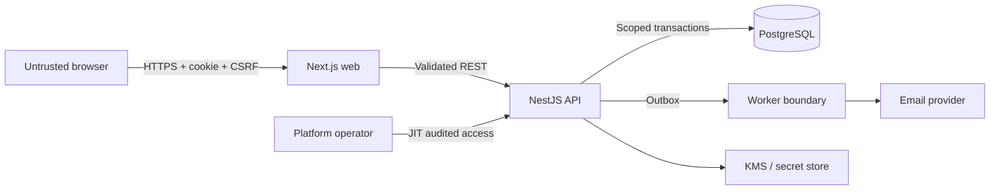

# Onboarding Threat Model

Status: Canonical baseline

Method: STRIDE with abuse-case analysis

Scope: Registration through workspace activation

## 1. Security objectives

1. Only a verified person can create and activate an organization.
2. Every organization-owned operation is isolated to an authorized membership.
3. Privileged owners establish MFA before activation.
4. Registration, verification, invitations, and activation resist automation,
   replay, enumeration, and race conditions.
5. Tokens, session credentials, MFA secrets, personal data, and audit evidence
   remain confidential and tamper-evident.
6. Failed external services cannot create contradictory onboarding state.

## 2. Trust boundaries



Boundary rules:

- Browser input is always untrusted.
- The web layer cannot grant authorization.
- Organization context is resolved by the API from session and membership.
- Worker messages may be duplicated, delayed, reordered, or maliciously formed.
- External-provider success does not override internal state.

## 3. Assets and classification

| Asset | Classification | Integrity requirement |
|---|---|---|
| Session credential | Highly restricted | rotation, revocation, hashed storage |
| Password hash | Highly restricted | adaptive hash, authentication-only access |
| MFA secret/recovery codes | Highly restricted | encrypted/hashed, never logged |
| Verification/invitation token | Highly restricted | hashed, expiring, single-use |
| User identity and contact data | Restricted | minimal collection and controlled access |
| Organization/property address | Confidential | organization-scoped |
| Membership and role | Restricted | atomic, audited changes |
| Onboarding state | Internal | explicit transitions and concurrency control |
| Audit/outbox records | Restricted | append-oriented, correlated, immutable facts |

## 4. Risk model

Likelihood and impact use a 1–5 ordinal scale.

```text
Risk score = Likelihood × Impact
Critical: 20–25
High:     12–19
Medium:    6–11
Low:       1–5
```

Scores prioritize engineering work; they are not quantitative breach
probabilities.

## 5. Threat register

| ID | STRIDE | Threat | L | I | Score | Required mitigation | Verification |
|---|---|---|---:|---:|---:|---|---|
| T01 | Spoofing | Credential stuffing takes over an owner account | 4 | 5 | 20 | adaptive password hash, rate limits, breached-password control, MFA, session anomaly events | auth integration and abuse tests |
| T02 | Information disclosure | Registration/resend reveals whether an email exists | 4 | 4 | 16 | uniform accepted response, bounded timing, rate limits, safe support copy | enumeration tests |
| T03 | Spoofing | Stolen verification or invitation token is replayed | 3 | 5 | 15 | random token, keyed hash storage, short expiry, purpose/subject binding, single transaction consume | replay/concurrency tests |
| T04 | Tampering | Browser supplies another organization ID | 5 | 5 | 25 | derive context from session membership, scoped repository, composite FK, optional RLS, deny-by-default | cross-tenant suite |
| T05 | Elevation | Invitee changes proposed role to Owner | 3 | 5 | 15 | server allowlist, inviter permission, immutable invitation claim, owner role excluded | contract and authorization tests |
| T06 | Tampering | Duplicate requests create multiple organizations | 3 | 4 | 12 | idempotency record, unique constraints, atomic organization/membership/progress transaction | concurrency tests |
| T07 | Elevation | Workspace activates without verified MFA/property/unit | 3 | 5 | 15 | lock progress, recompute readiness from authoritative tables, optimistic version, explicit transition | readiness truth table |
| T08 | Repudiation | Owner denies invitation or activation | 2 | 4 | 8 | immutable audit event with actor, session, correlation, timestamp and outcome | audit integration test |
| T09 | Information disclosure | Tokens or MFA secret enter logs/analytics | 3 | 5 | 15 | structured allowlist logging, redaction tests, sensitive-type wrappers, prompt exclusion | log snapshot and DLP tests |
| T10 | Denial of service | Automated signup/resend exhausts email or API | 4 | 3 | 12 | layered rate limits, cooldown, quotas, queue backpressure, provider circuit breaker | load/abuse test |
| T11 | Tampering | CSRF creates organization/invitation in victim session | 3 | 5 | 15 | SameSite cookie, CSRF token, Origin validation, unsafe-method policy | CSRF integration tests |
| T12 | Spoofing | Session fixation or stolen cookie survives privilege change | 3 | 5 | 15 | rotate after auth/MFA/role change, secure Host cookie, idle/absolute expiry, revoke family | session lifecycle tests |
| T13 | Tampering | Race accepts invitation twice or after revocation | 3 | 4 | 12 | row lock/conditional update, unique membership, one-use challenge | concurrent acceptance tests |
| T14 | Information disclosure | Support operator silently reads customer onboarding data | 2 | 5 | 10 | JIT purpose-bound access, metadata-first support, customer-visible audit, alerts | privileged access review |
| T15 | Denial of service | Email provider outage blocks all progress | 3 | 3 | 9 | outbox, retry with jitter, delivery state, resend recovery, provider abstraction | failure injection |
| T16 | Tampering | Duplicate outbox delivery sends repeated invitations | 4 | 3 | 12 | consumer idempotency key, delivery attempt state, deduplication | duplicate delivery test |
| T17 | Information disclosure | Optional logo upload carries malware or active content | 2 | 4 | 8 | defer from activation, size/type validation, private storage, scanning, safe transformation | malicious upload suite |
| T18 | Elevation | Mass assignment modifies status/version/ownership | 3 | 5 | 15 | strict DTO allowlists, `additionalProperties: false`, command-specific mapping | fuzz/contract tests |
| T19 | Tampering | Slug confusion enables workspace impersonation | 3 | 3 | 9 | normalized uniqueness, reserved names, confusable review, redirects tracked | normalization tests |
| T20 | Information disclosure | Cache/search key omits organization scope | 3 | 5 | 15 | organization in key, scoped adapters, isolation tests for every secondary store | cache/search isolation tests |

## 6. Abuse cases

### Cross-tenant identifier substitution

An authenticated owner in organization `A` captures a valid property ID from
organization `B` and submits it in a unit command.

Required result:

- return organization-scoped `404` or policy-approved `403`;
- create no unit, audit mutation, or observable side channel in `B`;
- record a security signal without logging sensitive resource data.

### Invitation privilege escalation

An invitee changes the browser request from `PROPERTY_MANAGER` to `OWNER`.

Required result:

- command rejected by server role allowlist;
- invitation remains unchanged;
- repeated attempts produce a security event and rate response.

### Concurrent workspace activation

Two browser tabs submit activation with the same or different idempotency keys.

Required result:

- exactly one state transition and one `WorkspaceActivated` event;
- all valid retries return the same active representation;
- stale versions return a stable conflict/precondition error.

## 7. Security requirements by component

### Browser and Next.js

- No credential or token in local storage, URLs, analytics, or client logs.
- Content Security Policy starts restrictive and is tested before external scripts.
- State-changing requests include CSRF proof and same-origin credentials.
- Server errors are mapped to safe field/general messages.

### NestJS API

- Global validation rejects unknown properties.
- Request size, content type, timeout, and rate limits are explicit.
- Authentication, organization resolution, authorization, validation, and command
  execution occur in that order.
- Controllers do not access Prisma directly.
- Correlation and security event context survives async processing.

### PostgreSQL

- Least-privilege application and migration roles are separate in production.
- Composite organization keys block cross-tenant links.
- Session/token hashes and encrypted secrets use separate access paths.
- Backups inherit encryption and access restrictions.

### Worker/email

- Messages are schema/version validated and idempotent.
- Email templates never include secret values except the one-time link delivered
  to the intended address.
- Provider webhooks, when added, require signature and replay verification.

## 8. Security test gate

The onboarding walking skeleton cannot enter production until:

- all Critical and High threats have implemented controls and automated tests;
- no unexpired risk acceptance exists without an accountable owner;
- cross-tenant tests cover API, database relationships, storage, cache, worker,
  search, export, and error behavior in scope;
- session rotation, CSRF, token replay, MFA, and idempotency tests pass;
- logs are inspected during failed and successful flows for secret leakage;
- an independent security review is completed before processing real tenants.

## 9. Residual risks and future review triggers

- Human support abuse remains possible and requires operational monitoring.
- Email account compromise can defeat link-based verification.
- TOTP phishing remains possible; phishing-resistant MFA should be evaluated for
  enterprise roles.
- Re-run this model when adding billing, Stripe Connect, bulk imports, custom
  domains, SSO, public APIs, mobile clients, AI, or multi-region deployment.
